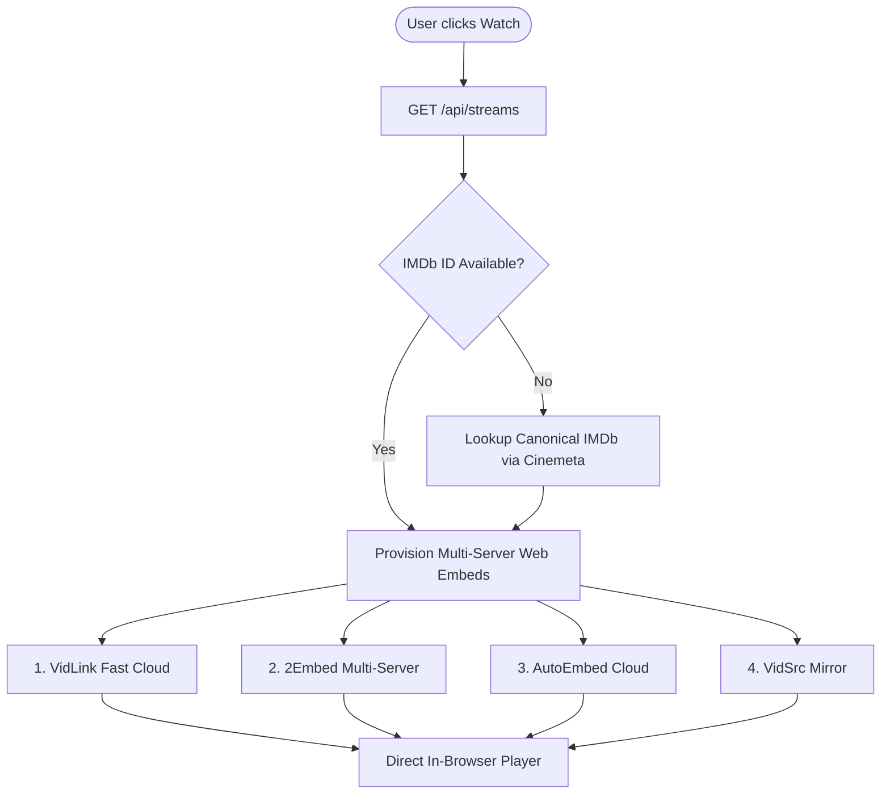

# Joywatch • Agent & Architecture Field Guide (AGENTS.md)

> **FOR FUTURE AI AGENTS & DEVELOPERS:**  
> This file is the single source of truth for the **Joywatch** codebase. Read this document before making any modifications to the backend, frontend, streaming resolvers, or styling.

---

## 1. Project Overview & Identity

- **Project Name:** Joywatch (formerly MovieBox TUI / MovieBox Web)
- **Tagline:** Ambient Cinema Streaming & Discovery
- **Platform:** Lightweight, high-performance web application backed by a native Python threaded server.
- **Core Philosophy:**
  - **Zero External Dependencies:** No npm packages, no heavy node_modules, no pip installations. Pure Python standard library on the backend, vanilla modern ES6+ and CSS3 on the frontend.
  - **Fluid Direct In-Browser Playback:** High-speed in-browser full-screen video player with automatic multi-server failover mirrors (VidLink, 2Embed, AutoEmbed, VidSrc).
  - **Aesthetic Dark Minimalism:** High-contrast, uncrowded, distraction-free cinematic interface inspired by luxury Swiss typography and modern motion-driven interfaces.

---

## 2. Strict UI/UX Commandments (Non-Negotiable Invariants)

Any agent working on Joywatch **MUST STRICTLY ADHERE** to these rules. Under no circumstances should these constraints be bypassed or compromised:

| Rule | Invariant Specification |
| :--- | :--- |
| **NO GRADIENTS** | **Strictly 0 gradients.** Never use `linear-gradient`, `radial-gradient`, `conic-gradient`, or SVG `<linearGradient>`. All colors must be solid `#hex` or clean solid `rgba(r, g, b, a)` alpha tints. |
| **NO PURPLE** | **Strictly 0 purple or indigo hues.** Never use purple, violet, magenta, indigo, lavender, `#6366F1`, `#8B5CF6`, `#A855F7`, or `#EC4899`. Palette is pure Obsidian, Charcoal, Slate, and Crisp White with subtle warm amber (`#EAB308`) for star ratings. |
| **NO EMOJIS** | **Strictly 0 emojis.** Never use emojis (`★`, `⭐`, `⚡`, `🎬`, `✨`, `🔥`, `📺`, `❤️`, `🎌`, `🕒`, etc.) in HTML, CSS, JavaScript, toasts, card metadata, or headers. Use delicate, small inline SVGs or clean text only. |
| **NO VLC OPTION** | **Strictly no VLC buttons, toggles, or options in the UI.** All playback is direct in-browser streaming. Never present desktop VLC launcher buttons or detach options to the user. |
| **ROUND CORNER BUTTONS** | All interactive buttons, nav pills, search inputs, genre tags, episode buttons, stream cards, and toast notifications must have round pill corners (`border-radius: 9999px`). |
| **MINIMAL & UNCLUTTERED** | Do not crowd the screen. Keep generous margins (`44px` gap between rows). No cluttered bento boxes, promotional widgets, or unnecessary badges. |
| **ICON & COVER SIZING** | **Keep icons small** (`12px` - `14px` delicate SVGs with `1.75px`–`2px` strokes). **Keep movie covers large and prominent** (`210px` × `315px`, 2:3 aspect ratio). |
| **JOYWATCH LOGO SIZING** | Keep the Joywatch wordmark small and refined (`font-size: 0.88rem`, `letter-spacing: 0.12em`, uppercase). Keep the logo icon small (26px circle containing a 12px geometric play icon). |
| **NAVIGATION TYPOGRAPHY** | Discover, Movies, Series, Anime, JoyList text must be small (`font-size: 0.78rem` / `12.5px`, `font-weight: 500`). The Settings nav pill/tab follows the same sizing. |
| **NAVIGATION COUNT** | Desktop `.joy-nav-pills` and mobile `.joy-bottom-nav` each carry **6 entries**: Home, Movies, TV Shows, Search, My List, Settings (`data-filter="settings"`). Do not remove or reorder them without updating `handleFilterChange()`, `hideAllViews()`/`showHomeViews()`, and both nav blocks. |
| **ENLARGED SEARCH BAR** | The search input container must remain comfortable and spacious (`height: 42px`, `min-width: 290px` to `360px`, `padding: 0 16px`, pill radius, `/` keyboard shortcut). |
| **NO ENGINE READY BUTTON** | The previous "Engine Ready" badge button in the navbar has been permanently excised. Do not re-add it. |
| **CLEAN MODAL & RIGHT-SIDE SERVERS OPTION** | Do not crowd the detail modal with "Streaming Sources & Audio" lists. The modal button is named **"Play"** and defaults to the topmost server. The bottom bar has been excised to prevent overlapping with embed video player controls. A small "Servers ▾" option on the right side opens all streaming server options on click. Fullscreen is handled natively by the embedded player. |
| **NEVER REINTRODUCE MOV_BBB.MP4** | The 10-second Big Buck Bunny cartoon fallback (`mov_bbb.mp4`) was an old bug that played cartoon clips instead of movies. It must never be re-introduced. |

---

## 3. Kinetic Motion & Animation System

Joywatch features ultra-smooth, 60fps/120fps hardware-accelerated motion:

### Easing Physics Tokens
```css
--ease-smooth: cubic-bezier(0.16, 1, 0.3, 1);       /* Fluid deceleration */
--ease-out-quint: cubic-bezier(0.22, 1, 0.36, 1);   /* Natural arrival */
--ease-spring: cubic-bezier(0.175, 0.885, 0.32, 1.15); /* Tactile bounce */
--ease-bounce: cubic-bezier(0.34, 1.56, 0.64, 1);   /* Snappy spring */
```

### Motion Architectural Principles
1. **GPU Compositor Acceleration**: Moving elements (`.movie-card`, `.modal-dialog`, `.joy-player-overlay`, `.joy-toast`, buttons) utilize `will-change: transform, opacity;`, `transform: translateZ(0);`, and `backface-visibility: hidden;` to eliminate paint thrashing.
2. **Movie Card Hover Experience**:
   - Card container smoothly translates up (`translateY(-8px) scale(1.025)`) with an expanded shadow (`0 20px 48px rgba(0,0,0,0.7)`).
   - Poster image zooms subtly (`scale(1.06)`) with a brightness lift.
   - Quick-action play button springs up from `translateY(12px) scale(0.9)`.
3. **Fluid Modal & Player Transitions**:
   - Modals and the video player avoid abrupt `display: none` / `display: flex` cuts.
   - Opening invokes two-phase `requestAnimationFrame` to trigger CSS opacity and scale transforms (`scale(0.92) translateY(24px)` -> `scale(1) translateY(0)`).
   - Closing runs a reverse transition before teardown (`320ms`).
4. **Momentum Drag-to-Scroll**:
   - All horizontal card tracks (`.shelf-cards-track`) support native click-and-drag scrolling with mouse/trackpad momentum.
   - Click suppression prevents accidental movie selection when dragging.
   - Navigation arrows scroll dynamically by `75%` of the visible container width.
5. **Image Fade-in**:
   - Movie covers load with `opacity: 0` and transition to `opacity: 1` upon `onload`, preventing jarring image pop-in.
6. **Tactile Spring Micro-Interactions**:
   - All buttons feature an active press state (`transform: scale(0.96); transition-duration: 80ms;`) providing physical tactile feedback.
7. **Accessibility**:
   - Full `@media (prefers-reduced-motion: reduce)` override to zero-duration animations for motion-sensitive users.

---

## 4. Mobile Optimization & Responsive Architecture

Joywatch is deeply optimized for mobile devices (iOS, Android, tablets) following modern mobile web standards:

1. **Viewport & Safe Areas**:
   - `viewport-fit=cover` handles notches, camera holes, and dynamic islands.
   - CSS safe-area tokens (`--safe-top`, `--safe-bottom`, `--safe-left`, `--safe-right`) ensure content never collides with system UI bars or home indicators.
2. **Mobile Floating Bottom Navigation**:
   - On viewports `<= 768px`, desktop top navigation pills are hidden and replaced by a sleek, floating bottom navigation bar (`.joy-bottom-nav`).
   - Provides 5 thumb-friendly tabs: Discover, Movies, Series, Anime, JoyList with active state synchronization with the desktop engine.
3. **Touch Targets & Gestures**:
   - Minimum `44px` × `44px` touch targets across all interactive buttons.
   - `touch-action: manipulation;` and `-webkit-tap-highlight-color: transparent;` eliminate the 300ms tap delay and mobile browser tap artifacts.
4. **Mobile Media Shelves**:
   - Poster cards scale to `155px` × `232px` (exact 2:3 ratio) on mobile, displaying ~2 cards with a right-edge peek to invite horizontal swipe.
   - Hardware-accelerated touch momentum (`-webkit-overflow-scrolling: touch; scroll-snap-type: x mandatory;`).
5. **Mobile Bottom Sheet Modal**:
   - Modals convert into a bottom-sheet drawer (`max-height: 92vh; border-radius: 20px 20px 0 0`) with a pull handle indicator (`.modal-sheet-handle`).
6. **Search Grid Responsive Columns**:
   - 2-column full-width responsive grid on mobile (`gap: 12px`).

---

## 5. Architecture & Technical Stack

```
c:\Projects\moviebox-web\
├── server.py                   # Multi-threaded HTTP server & API gateway
├── start-moviebox-web.bat      # Windows batch starter
├── start-moviebox-web-hidden.vbs # Background Windows VBS runner
├── public\                     # Static web client
│   ├── index.html              # Clean semantic HTML5 structure
│   ├── style.css               # Minimalist styling & animation engine
│   ├── app.js                  # Vanilla JS frontend client
│   ├── playback-providers.js   # Provider adapter registry (resume, origin validation)
│   ├── watch-progress.js       # localStorage watch-progress store + session tracker
│   └── settings-store.js       # Settings store + per-media server memory + themes
├── design-system\              # UI/UX design tokens and documentation
└── agents.md                   # This field guide
```

### Backend: `server.py`
- **Server Core:** Built on `socketserver.ThreadingTCPServer` with `JoywatchHandler(http.server.SimpleHTTPRequestHandler)`.
- **Thread Safety:** `daemon_threads = True` ensures requests do not block each other.
- **Resilient Port Binding:** Automatically probes and binds to the first available port: `[7680, 7700, 7860, 8080]`.
- **Proxy Capabilities:** Custom streaming proxy at `/api/stream-proxy` supporting **HTTP 206 Partial Content (Range requests)** for direct `.mp4` and `.m3u8` video streaming.
- **MovieBox Native Signatures:** Implements MovieBox mobile API HMAC-MD5 signing protocol (`X-Client-Token`, signature generation).

### Frontend: `public/`
- **`index.html`**: Zero-emoji semantic layout with small Joywatch brand typography, enlarged search bar, hero canvas, uncrowded media shelves, cinema modal dialog, pure in-browser player viewport, Settings nav pill + mobile tab, and the Settings dedicated view.
- **`style.css`**: Strict flat color system (`#090A0E`, `#11131A`, `#151720`, `#FFFFFF`), round-corner buttons, fluid kinetic easing curves, GPU acceleration, `[data-theme]` accent overrides, and Settings view styles.
- **`app.js`**: Client controller handling catalog rendering, debounced search (`240ms`), JoyList bookmark storage (`localStorage`), modal lifecycle, pure in-browser web player dispatch, per-media server preference read/write, and Settings view rendering.
- **`settings-store.js`**: Settings + per-media server memory + theme application. Owns two localStorage keys (see §9); exposes `window.JoywatchSettings`. Every read is try/catch — corrupt data yields clean defaults and never throws into the player.
- **`playback-providers.js`**: Provider adapter registry (`window.JoywatchProviders`) with exact-match origin validation and per-provider resume support flags.
- **`watch-progress.js`**: Watch-progress store (`joywatch_progress_v1`) plus the per-session playback tracker that feeds Continue Watching / Recently Watched.

---

## 5. Streaming Architecture & Resolvers

When a user clicks "Watch Now" or selects a stream, the system queries `/api/streams`:



### Web Player Resolution Targets
1. **VidLink Fast Cloud**: `https://vidlink.pro/movie/{imdb_id}` (or `/tv/{imdb_id}/{s}/{e}`)
2. **2Embed Multi-Server**: `https://www.2embed.cc/embed/{imdb_id}` (or `/embedtv/{imdb_id}&s={s}&e={e}`)
3. **AutoEmbed Cloud**: `https://autoembed.co/movie/imdb/{imdb_id}` (or `/tv/imdb/{imdb_id}/{s}/{e}`)
4. **VidSrc Mirror**: HD embed mirror fallback.

---

## 6. Complete API Reference

### 1. Catalog Discovery
- **Endpoint:** `GET /api/catalog`
- **Query Parameters:**
  - `type`: `movie` | `series` (default: `movie`)
  - `genre`: Optional genre filter (e.g. `Action`, `Sci-Fi`, `Animation`)
  - `page`: Page index (default: `1`)
- **Response Format:**
  ```json
  {
    "items": [
      {
        "id": "tt28014327",
        "name": "Mayday",
        "poster": "https://...",
        "background": "https://...",
        "year": "2025",
        "imdbRating": "8.8",
        "genres": ["Action", "Sci-Fi"],
        "type": "movie"
      }
    ]
  }
  ```

### 2. Search Titles
- **Endpoint:** `GET /api/search?q={query}`
- **Query Parameters:**
  - `q`: Search string (debounced at 240ms on frontend)
- **Response Format:** Same as `/api/catalog`.

### 3. Metadata & Episodes
- **Endpoint:** `GET /api/meta?type={type}&id={id}`
- **Response Format:** Detailed title information including synopsis, genres, and video/episode lists for TV series.

### 4. High-Speed Streams
- **Endpoint:** `GET /api/streams`
- **Query Parameters:**
  - `type`: `movie` | `series`
  - `id`: IMDb ID (`tt...`) or MovieBox subject ID
  - `title`: Movie or show title for fallback resolution
  - `season`: Season number (default: `1`)
  - `episode`: Episode number (default: `1`)
- **Response Format:**
  ```json
  {
    "streams": [
      {
        "title": "Feature Film - 1080p Ultra HD (Instant Play)",
        "quality": "1080p Ultra HD",
        "url": "https://vidlink.pro/movie/tt28014327",
        "browser_url": "https://vidlink.pro/movie/tt28014327",
        "is_embed": true,
        "direct_playable": true
      }
    ]
  }
  ```

### 5. Legacy Desktop Media Endpoint (Internal / Not Exposed in UI)
- **Endpoint:** `POST /api/play-vlc`
- **Note:** The Joywatch UI has completely removed all VLC options and buttons. This endpoint remains only as a dormant backend utility.
- **Payload:**
  ```json
  {
    "url": "magnet:?xt=... or stream_url",
    "title": "Movie Title"
  }
  ```
- **Response Format:** `{"success": true, "message": "Launched in VLC Player"}`

### 6. Streaming Proxy (HTTP 206 Range)
- **Endpoint:** `GET /api/stream-proxy?url={encoded_target_url}`
- **Headers Handled:** `Range: bytes=start-end` forwarded to target; responds with `206 Partial Content` and proper `Content-Range`.

---

## 7. How to Run, Test, and Verify

### Running the Server
```powershell
# In c:\Projects\moviebox-web\
python server.py
```
The server will automatically detect an available port (`7680` or fallback `7700`) and print:
```
=================================================================
   Joywatch • Ambient Cinema Streaming & Discovery
=================================================================
[*] URL              : http://localhost:7700
[*] VLC Player       : C:\Program Files\VideoLAN\VLC\vlc.exe
[*] Stream Proxy     : Active (HTTP 206 Range Enabled)
=================================================================
[+] Joywatch running at http://localhost:7700
```

### Verification Commands for Agents
```powershell
# 1. Test Static Routes
python -c "import urllib.request; [print(u, urllib.request.urlopen('http://localhost:7700' + u).status) for u in ['/', '/style.css', '/app.js', '/settings-store.js', '/playback-providers.js', '/watch-progress.js']]"

# 2. Test Catalog API
python -c "import urllib.request, json; data = json.loads(urllib.request.urlopen('http://localhost:7700/api/catalog').read().decode()); print('Catalog items:', len(data.get('items', [])))"

# 3. Test Stream Resolver
python -c "import urllib.request, json; data = json.loads(urllib.request.urlopen('http://localhost:7700/api/streams?type=movie&id=tt28014327').read().decode()); print('Streams count:', len(data.get('streams', [])))"

# 4. Enforce Invariant Audits (Must return zero matches)
python -c "import subprocess; [print('Prohibited:', p, len(subprocess.run(['git', 'grep', '-i', p], capture_output=True).stdout)) for p in ['linear-gradient', 'radial-gradient', 'conic-gradient', '6366F1', '8B5CF6', 'A855F7', 'EC4899', 'mov_bbb']]"
```

---

## 8. Settings, Themes & Server Memory

The Settings tab (`data-filter="settings"`, dedicated `#settings-view`) is the single place for
UI personalization and server arrangement. It lives in three pieces:

- **`public/settings-store.js`** (`window.JoywatchSettings`) — the store, the theme applier,
  and the per-media server memory. No other module may write these keys directly.
- **`public/app.js`** — `renderSettingsView()` + theme/server/toggle/data renderers, invoked
  from `handleFilterChange('settings')`. Server-preference read (`resolvePreferredIndex()`) and
  write (`rememberServerChoice()`) helpers used by the play paths and `switchPlayerServer()`.
- **`public/style.css`** — `[data-theme='…']` overrides, `.reduce-motion` support, and the
  `.settings-view` / `.theme-swatch` / `.server-row` / `.settings-toggle` component styles.

### localStorage Keys (all user state)

| Key | Owner | Shape |
| :--- | :--- | :--- |
| `joywatch_list` | `app.js` | My List array, JSON |
| `joywatch_progress_v1` | `watch-progress.js` | Watch-progress map (`type:id:season:episode` → entry) |
| `joywatch_debug_playback` | `watch-progress.js` / `settings-store.js` | Debug flag (`'1'` enables) |
| `joywatch_settings_v1` | `settings-store.js` | `{ theme, serverOrder, hiddenServers, favoriteServers, autoplayNext, reducedMotion }` |
| `joywatch_server_pref_v1` | `settings-store.js` | Per-media server memory: `{ "type:id:season:episode": "<providerId>" }` |

### Theme Contract

- Themes: `obsidian` (default, existing `:root`), accent-only variants `amber` (`#EAB308`),
  `cyan` (`#22D3EE`), `rose` (`#F43F5E`), `slate-blue`/Steel (`#60A5FA`, blue not indigo),
  `graphite` (`#9CA3AF`), and the lighter base `slate` (`#0F172A` backgrounds).
- No theme may introduce a gradient, a purple/indigo/magenta hue, or an emoji. Theme previews
  are solid-color dots only.
- `applyTheme()` clears **every** theme-managed inline var before setting the new theme's, so
  switching back to Obsidian truly resets. It also keeps `html[data-theme]` in sync (the static
  slate navbar/hero/bottom-nav overrides key off it) and mirrors `--joy-bg` onto
  `<meta name="theme-color">`.
- An inline `<script>` in `<head>` sets `data-theme` before first paint to prevent a theme flash.

### Server Preference Contract (binding on all play paths)

- The persisted value is the **provider id** (`vidlink`, `nexstream`, `autoembed`, `vidsrc-pm`,
  `vidsrc-su`, `vidjoy`, `2embed` — as returned by `JoywatchProviders.identify()`), **never a
  stream index**. Indices 0–6 are only stable when the IMDb id resolves; `/api/streams` appends
  data-dependent MovieBox CDN and Torrentio entries after the fixed 7.
- Key shape mirrors the progress store: `type + ':' + id + ':' + season + ':' + episode`
  (per-episode memory for series).
- **Read** in `loadStreams` autoPlay and `modalPlayBtn` via `resolvePreferredIndex()`; resolve
  `id → index` against the *live* `activeModalStreams` and fall back to `0` on `-1`.
- **Write** in `switchPlayerServer()` via `rememberServerChoice()` only. Skip when `identify()`
  returns `null` (Torrentio/proxy streams have no stable provider). Both helpers are
  best-effort try/catch — preference code must never break playback.
- `renderPlayerServerPills()` and `switchPlayerServer()` must both use the single
  `serverLabelFor(stream, index)` helper (keyed on `identify()`), never ad-hoc
  `title.includes('vidsrc')` matching — `vidsrc.pm` and `vidsrc.su` are distinct servers.
- `setAll()` refuses to persist a hide-everything state (at least one server stays visible).
- Server order/favorites/hidden are applied as a pre-pass over `activeModalStreams` in
  `loadStreams` (`applyServerPreferences()`), so pill rendering, index math, and tag text all see
  the same ordering.
- View routing goes through the shared `hideAllViews()` + `showHomeViews()` helpers;
  `handleFilterChange()` is the only place that adds a view branch.

---

## 9. Summary Checklist for Future Agent Changes

Before concluding any future work on Joywatch, verify:
- [ ] No gradients introduced (`linear-gradient`, `radial-gradient`, etc.).
- [ ] No purple or indigo hues introduced.
- [ ] No emojis in HTML, CSS, JS, toasts, or templates.
- [ ] No VLC buttons, switches, or options in the UI (pure in-browser streaming).
- [ ] Buttons retain round pill corners (`border-radius: 9999px`).
- [ ] Joywatch text and icon remain small and refined.
- [ ] Navigation pill links remain small (`0.78rem`).
- [ ] Search input remains enlarged and comfortable (`42px` height).
- [ ] Movie poster covers remain large (`210px` × `315px`).
- [ ] Animations remain smooth, GPU-accelerated, and respect `prefers-reduced-motion`.
- [ ] In-browser streaming continues to function without cartoon fallbacks.
- [ ] Server responds with `200 OK` across `/`, `/style.css`, `/app.js`, `/settings-store.js`, and `/api/catalog`.
- [ ] No theme introduces a gradient, a purple/indigo hue, or an emoji (audit swatch hexes too).
- [ ] Server preferences persist provider ids (never indices) under `joywatch_server_pref_v1`.
- [ ] Both navs still carry exactly 6 entries and the Settings view renders on desktop + mobile.
